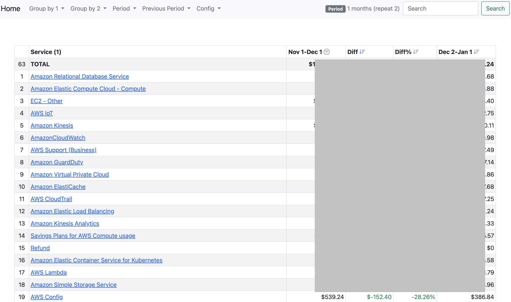

# cloudcostexplorer
[](https://godoc.org/github.com/rrgmc/cloudcostexplorer)

`cloudcostexplorer` is a developer-oriented local HTTP UI for the cost explorer APIs of various cloud providers.

Supported APIs:

- AWS cost explorer
- GCP billing export to BigQuery

The UI supports filtering and multiple groupings using the menus and clicking the column values, allowing drill-down cost 
analysis.

Advanced filters that are hard to use with the default cloud UIs like grouping and filtering by tags / labels / resources
are available.

## Screenshot



## Usage

Download a binary from the [Releases](https://github.com/rrgmc/cloudcostexplorer/releases) Github page, or if you have
a Golang compiler available:

```shell
$ go install github.com/rrgmc/cloudcostexplorer/cmd/cloudcostexplorer@latest
```

Create a local `cloudcostexplorer.conf` configuration file based on [cloudcostexplorer_example.conf](https://github.com/rrgmc/cloudcostexplorer/blob/master/cloudcostexplorer_example.conf),
with the accounts that have access to your cost explorer APIs, and run the `cloudcostexplorer` cli.

It will try to find a `cloudcostexplorer.conf` file in the current directory, and start a local webserver on `http://localhost:3335`.

## Golang library

It can also be used as a Go library, the interfaces are designed to serve this specific UI, but it can probably be
useful in other use cases. See [cloud.go](https://github.com/rrgmc/cloudcostexplorer/blob/master/cloud.go) to have an
idea of what it looks like.

## Author

Rangel Reale (rangelreale@gmail.com)
